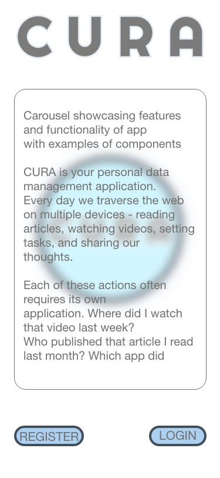
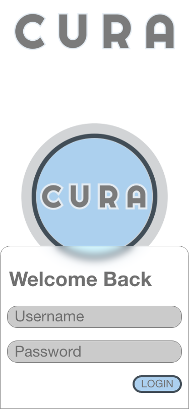
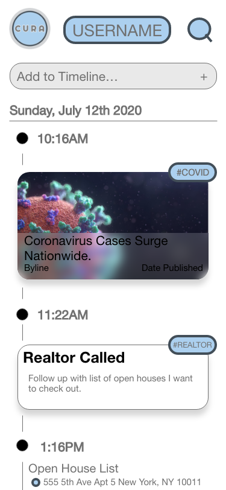
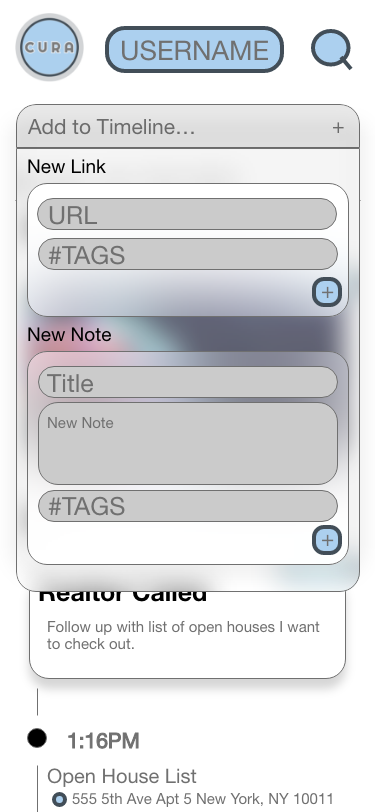
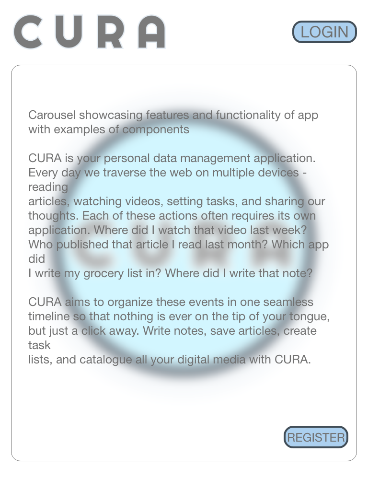
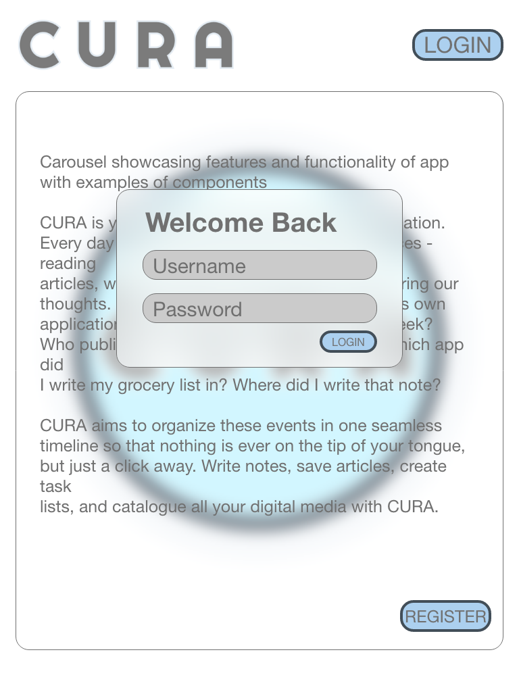
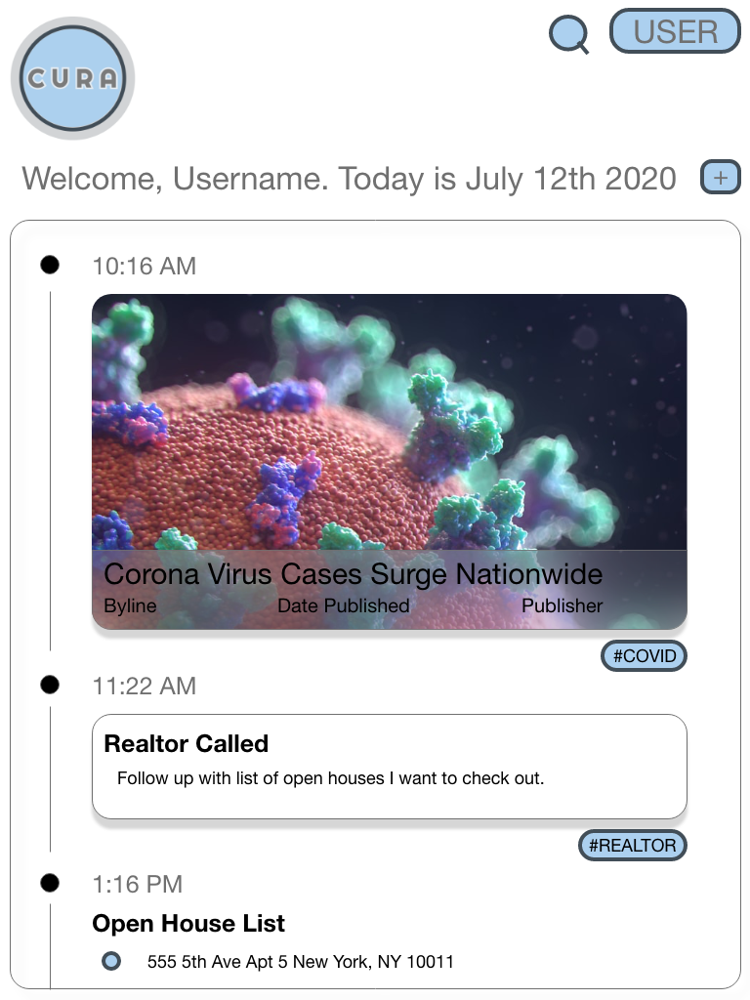
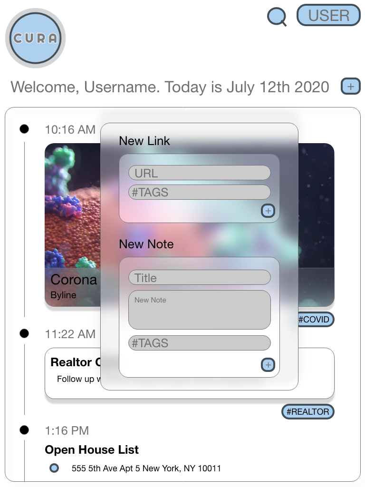

***

- [Overview](#overview)
- [MVP](#mvp)
  - [Goals](#goals)
  - [Libraries and Dependencies](#libraries-and-dependencies)
  - [Client (Front End)](#client-front-end)
    - [Wireframes](#wireframes)
    - [Component Tree](#component-tree)
    - [Component Hierarchy](#component-hierarchy)
    - [Component Breakdown](#component-breakdown)
    - [Time Estimates](#time-estimates)
  - [Server (Back End)](#server-back-end)
    - [ERD Model](#erd-model)
- [Post-MVP](#post-mvp)
- [Code Showcase](#code-showcase)
- [Code Issues & Resolutions](#code-issues--resolutions)

<br>

## Overview

CURA is your personal data management application. Every day we traverse the web on multiple devices - reading articles, watching videos, setting tasks, and sharing our thoughts. Each of these actions often requires its own application. Where did I watch that video last week? Who published that article I read last month? Which app did I write my grocery list in? Where did I write that note? CURA aims to organize these events in one seamless timeline so that nothing is ever on the tip of your tongue, but just a click away. Write notes, save articles, create task lists, and catalogue all your digital media with CURA. 


<br>

## MVP

The CURA MVP will include a functioning server with SQL tables for Users, User Posts, and User Links. The CURA MVP will also deliver a functioning front end via React.js that includes minimal styling as well as the base functionality that allows users to sign up, sign in, view their personal timelines, as well as add either a note or a link to their timeline. Each user will have two timelines, one that spans their time as a user, and one for each day. 

<br>

### Goals

- Create a dynamic and interactive application that is as engaging and delighful as it is useful. 
- Utilize Bcrypt and JWT to create a userbase for the application. 
- Integrate dynamic functions that render data efficiently. 
- Utilize link metadata to render photos and article titles when a user renders a new link element to their personal timeline. 
- Incorporate elements that allow a user to customize their experience on the platform. 
- Utilize dynamic styling to create an interactive and dynamic user experience. 

<br>

### Libraries and Dependencies

|     Library      | Description                                |
| :--------------: | :----------------------------------------- |
|      React       | _User facing framework._ |
|   React Router   | _Link/Route components._ |
|      Axios       | _Handle and execute database queries._ |
|  Ruby on Rails   | _Development of backend/server functionality._ |
|     Bcrypt, JWT  | _Handling user authentication._ |


<br>

### Client (Front End)

  ##### Desktop Wireframes

- Desktop Landing


- Login PopOver


- UserTimeline


  ##### Mobile Phone Wireframes

- Mobile Landing



- Mobile Login



- Mobile TimeLine



- Mobile TimeLine Components




  ##### Tablet Wireframes

- Tablet Landing



- Tablet Login



- Tablet TimeLine



- Tablet Timeline Components




#### Component Tree


#### Component Hierarchy

``` structure

src
|__ assets/
      |__ fonts
      |__ graphics
      |__ images
      |__ wireframes
|__ components/
      |__ Header.jsx
      |__ Header.css
      |__ Login.jsx
      |__ Login.css
      |__ Landing.jsx
      |__ Landing.css
      |__ SignUpPage.jsx
      |__ SignUpPage.css
      |__ SingInPopUp.jsx
      |__ SingInPopUp.css
      |__ UserSettings.jsx
      |__ UserSettings.css
      |__ DailyTimeline.jsx
      |__ DailyTimeline.css
      |__ UserTimeline.jsx
      |__ UserTimeline.css
      |__ TimelineTextPostInput.jsx
      |__ TimelineTextPostInput.css
      |__ TimelineLinkInput.jsx
      |__ TimelineLinkInput.css
      |__ TimelineTextPost.jsx
      |__ TimelineTextPost.css
      |__ TimelineLinkPost.jsx
      |__ TimelineLinkPost.css
|__ services/
      |__ apiconfig.jsx
      |__ apihelper.jsx
      |__ auth.jsx
|__ App.js

```

#### Component Breakdown


|  Component   |    Type    | state | props | Description                                                      |
| :----------: | :--------: | :---: | :---: | :--------------------------------------------------------------- |
|    Header    | class      |   n   |   n   | _The header will contain the user sign in and logo._             |
|    Login     | class      |   y   |   n   | _The Login component will grant user access._                    |
|    Landing   | class      |   y   |   n   | _Landing page will provide app preview for new users._           |
|    SignUp    | class      |   y   |   n   | _Will allow new users to create an account._                     |
|    SignIn    | class      |   y   |   n   | _Will welcome returning users to the platform._                  |
| UserSettings | class      |   y   |   n   | _Allows existing users to change details and customize view settings._|
| DailyTimeline| class      |   y   |   n   | _Landing page after login, allows user to add text post and link post._|
| UserTimeline | class      |   y   |   n   | _Compiles all DailyTimelines from user History._|
|  LinkInput   | functional |   n   |   y   | _Interactive input component that allows users to add links to their timeline._|
|  TextInput   | functional |   n   |   n   | _Allows users to add text notes and journal entries to their timeline._|
|  TextPost    | class      |   n   |   y   | _Renders data from TextInput component to DailyTimeline Component._|
|  LinkPost    | class      |   n   |   n   | _Renders Metadata from LinkInput to DailyTimeline Component._|

#### Time Estimates

| Task                | Priority | Estimated Time | Time Invested | Actual Time |
| ------------------- | :------: | :------------: | :-----------: | :---------: |
| Develop server database|  H    |     5 hrs     |             |          |
| Create CRUD Actions |    H     |     5 hrs      |            |          |
| 12 Front End Components |   H  |     15 hrs      |            |          |
| Front End CRUD functions | H   |   5  hrs      |            |          |
| Base Styling        |    H     |     5 hrs      |           |          |
| Dynamic Styling     |    M     |    8 hrs      |           |          |
| TOTAL               |          |     43 hrs      |          |          |

<br>

### Server (Back End)

#### ERD Model


<br>

***

## Post-MVP

- Convert React.js files to either React Native or Cordova for later deployment to the App store.
- Continute building out database to add Timeline functionality including: 
  i.   User uploaded photos, videos, and scanned documents
  ii.  Daily task lists
  iii. Reminders, birthdays and deadlines (with incorporated notification functionality)
  iv.  User Wishlists for adding products from various stores around the web
  v.   Integrate GeoLocation and check in services like FourSquare
  vi.  Calendar functionality that integrates with Daily Timeline seamelessly. 
  vii. Bookmark functionality which saves important events, articles, and other media to a users profile.
- Create functionality for users to connect with one another via comments, likes, and messages - with a focus on collaboration as a business class application. 
- Functionality that recommends related content to users based on Links they've added to their Timeline, or what other users are sharing. 
- Allow users to collaborate on task lists, timeline text posts, send engaging messages, and comment and interact with user posts. 
- Integrate functionality that allows users to add private and public events to their timelines
- Develop a browser extension that allows users to seamlessly integrate browser history into their timelines, and decide which visited links they would like to add to their personal timeline. 

***

## Code Showcase


## Code Issues & Resolutions


